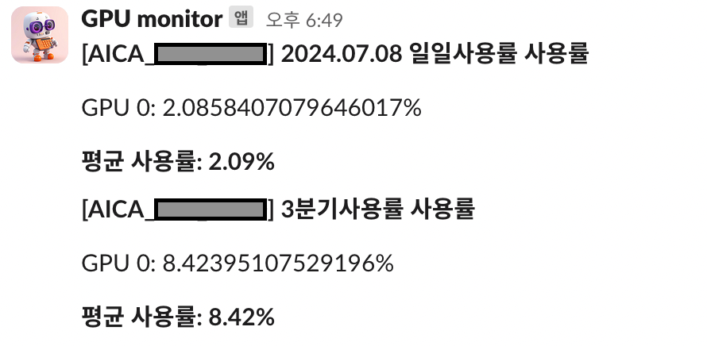

## Introduction
This program works as follwing.
1. Query GPU usage every minute and save it to GPU_REALTIME_USAGE_DIR.
2. Query GPU usage every 10 minutes and send a Slack message with the information.
3. Once a day, calculate the average GPU usage for the day from the data in GPU_REALTIME_USAGE_DIR, save it to GPU_DAILY_USAGE_DIR, and send a Slack message with the daily average usage.
4. Once a day, calculate the average GPU usage for the current quarter (January-March, April-June, July-September, October-December) from the data in GPU_DAILY_USAGE_DIR and send the average usage via Slack.

## HOW TO USE

### 01. Set up a slack incoming webhook
https://api.slack.com/messaging/webhooks

### 02. change urls to the target url in `my_url.py`
* SLACK_WEBHOOK_URL_REALTIME = 'https://your_webhook_url'
* SLACK_WEBHOOK_URL = 'https://your_webhook_url'
* GPU_REALTIME_USAGE_DIR = "FULL/PATH/TO/SAVE/GPU/USAGE/PER/1MINUTE/daily/"
* GPU_DAILY_USAGE_DIR = "FULL/PATH/TO/SAVE/DAILY/GPU/USAGE/daily_avg"

### 03. change this to current path in  `add_cron.sh`
* GPU_USAGE_FILE_PATH="/FULL/PATH/TO/CURRENT/DIRECTORY/gpu_usage.py"

### 04. install pandas
```pip install pandas```

### 05. run 
```bash add_cron.sh```
- this command will add cronjob in your server
- to check existing cronjobs, run ```crontab -e```
- if you have to run this command twice, delete previously added jobs. (otherwise cronjob will be run multiple times)

## Troubleshooting

thie program runs the following commands periodically (see `add_cron.sh` for details)
if there's any issue, please run these commands in command line and see if there's any error 
`GPU_USAGE_FILE_PATH="/FULL/PATH/TO/CURRENT/DIRECTORY/gpu_usage.py"`
* 01. send realtime gpu usage to slack
`/usr/bin/python3 $GPU_USAGE_FILE_PATH send_realtime_usage`
* 02. save gpu usage 
`/usr/bin/python3 $GPU_USAGE_FILE_PATH save_realtime_usage`
* 03. calculate daily gpu usage  and send to slack
`/usr/bin/python3 $GPU_USAGE_FILE_PATH send_daily_usage`
* 04. calculate gpu usage for this period and send to slack 
`/usr/bin/python3 $GPU_USAGE_FILE_PATH send_period_average`

### GPU usage info is empty
sometimes `nvidia-smi` format could be different in each server. 
please run this command to see if it's parsing fine as expected.
If there's any issue please see `get_gpu_info` in `gpu_usage.py`
```python3  $GPU_USAGE_FILE_PATH test_gpu_info_parse```

expected output:
```
   id power_usage power_total memory_usage memory_total gpu_usage
0   0        104W        700W         0MiB     81559MiB        0%
1   1        105W        700W         0MiB     81559MiB        0%
2   2        101W        700W         0MiB     81559MiB        0%
3   3        103W        700W         0MiB     81559MiB        0%
4   4        100W        700W         0MiB     81559MiB        0%
5   5        103W        700W         0MiB     81559MiB        0%
6   6        104W        700W         0MiB     81559MiB        0%
7   7        102W        700W         0MiB     81559MiB        0%

```

if there's error look into `parse_gpu_info` function <strong>espacially if the regex pattern matches your nvidia-smi output</strong>